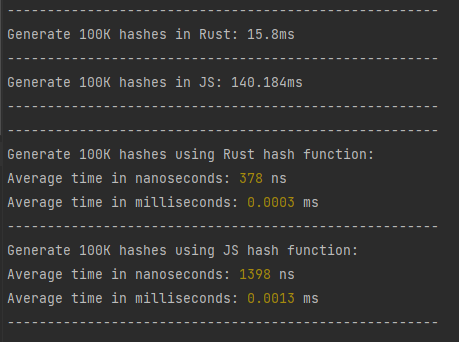

# Rust binary integration in Javascript

## Contact
- Eduardo Sánchez<br>


- whipshout@gmail.com<br>


- https://www.linkedin.com/in/eduardo-sanchez-sanchez/ <br>

## Info

- We can integrate **Rust with Node through native addons**, as we would with **C++**. <br>


- To do this, we have to interact with **Javascript through C**. We compile a **Rust library using C interfaces and bindings**. The library is in different formats depending on the operating system.<br>


- To do all the hard work, we use the **crate called NAPI**, which is responsible for making the interfaces and bindings with C and exporting the functions for use in Javascript.

## NAPI crate

- **NAPI** => https://napi.rs/ <br>


- **NAPI Crate** => https://crates.io/crates/napi/1.1.2 <br>


- **NAPI GitHub** => https://github.com/napi-rs/napi-rs <br>


- **NAPI Examples** => https://github.com/napi-rs/napi-rs/tree/main/examples <br>

## How to use this repo

- First you need to have installed **Node, npm and Rust**.<br>


- Second, **clone the repo** and open it with your favourite IDE (**I hope is from JetBrains**).<br>


- Third, you have to use the command ```npm install``` to **generate node modules**.<br>


- Fourth, use the command ```npm run build``` to **generate the native addon**. It will be generated in project root.<br>


- And last, use the command ```npm start``` to **execute the Javascript code** with the addon.<br>


## Changes

- If you want to change something about Rust code, **don't forget to recompile the addon** using ```npm run build```.<br>


- If you want to change something about Javascript code, you don't have to worry about anything, only **check if the imports of Rust functions are right**.


## Comparison Sha256 hash Rust and JS

<br>

Sha256 **18 bytes** item



<br>
